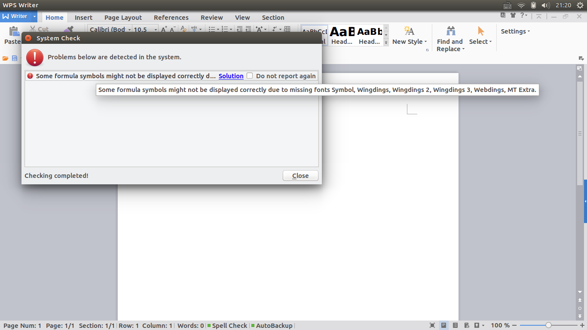

# 使用Ubuntu开发环境

## Windows和Ubuntu时间不一致

1. Ubuntu 16.04之前

   ``` bash
   sudo gedit /etc/default/rcS
   ```

   把 UTC=yes 改为 UTC=no

2. Ubuntu 16.04之后

   ``` bash
   timedatectl set-local-rtc 1 --adjust-system-clock
   ```

## 软件安装与卸载

[ubuntu安装和查看已安装](http://www.cnblogs.com/forward/archive/2012/01/10/2318483.html)

> 还是使用命令行好，看得见安装过程。

### 解压安装

解压：`sudo tar -zxvf ideaIU-2016.3.3-no-jdk.tar.gz -C /opt`

### 安装deb文件

``` bash
sudo dpkg -i <file>.deb
sudo apt-get install -f # Install dependencies
```

#### 安装修复

安装过程中出现错误

先修复

``` bash
sudo apt --fix-broken install
```

然后，再次安装

### 卸载软件

#### 彻底卸载

`https://zhidao.baidu.com/question/344235425.html`

### 更换Python版本

> [更改Ubuntu默认python版本的两种方法](http://blog.csdn.net/fang_chuan/article/details/60958329)

Ubuntu自动安装几个版本的Python，但是默认使用2.7版本，要想升到版本3，则需要更改别名：

1. `ls /usr/bin/python*`: 查看Ubuntu上存在的Python版本；

2. `sudo gedit ~/.bashrc`: 打开 `.bashrc` 文件；

3. 在`.bashrc` 文件中添加 `alias python='/usr/bin/python3.*'`(改为ubuntu上存在的版本)；

4. `. ~/.bashrc` : 刷新`.bashrc` 文件。

这样就可以使用Python3了。

> 若使用vscode进行Python开发，则需指定Python：`"python.pythonPath": "/usr/bin/python3.5"`

注意：最好的方式应该是使用虚拟环境virtualenv或者Anaconda进行Python版本的管理

### 常用软件安装资料

1. [MongoDB](https://docs.mongodb.com/master/tutorial/install-mongodb-on-ubuntu/?_ga=2.251839116.406550035.1506563296-1284722375.1506563296)

2. [Studio 3T](https://studio3t.com/whats-new/install-mongochef-mongodb-linux/)

3. [Sublime Text](http://www.sublimetext.com/docs/3/linux_repositories.html#apt)

4. [vs code](https://code.visualstudio.com/)

5. [WPS for Linux](http://linux.wps.cn/)、[WPS Office for Linux product download](http://wps-community.org/download.html)

6. [Chrome 离线包](http://www.google.cn/chrome/browser/thankyou.html?standalone=1&statcb=1)

    也可以选择安装chromium

7. [slack Linux](https://askubuntu.com/questions/823452/problems-installing-slack-desktop)

   ``` bash
   sudo apt-get remove slack && sudo dpkg  -i slack-desktop-2.1.2-amd64.deb
   ```

8. [docky](http://www.go-docky.com/)

   - Mac OS风格的dock

9. GoldenDict - [官网](http://goldendict.org/) - [github](https://github.com/goldendict/goldendict)

   - 非常强大的开源词典工具
   - `http://os.51cto.com/art/201109/291620.htm`
   - `https://blog.csdn.net/www_helloworld_com/article/details/85019862`
   - `http://forum.ubuntu.org.cn/viewtopic.php?f=95&t=265588`

### 可以更换成Mac的默认字体monaco

安装说明：`http://blog.csdn.net/qq_26990831/article/details/51847416`

- 设置默认字体参考脚本：`https://github.com/cstrap/monaco-font`
- 获取字体：`https://github.com/todylu/monaco.ttf/blob/master/monaco.ttf?raw=true`

### 问题处理

1. Sogou输入法安装出错

   在安装搜狗输入发的时候，可能会报以下错误：

   ``` bash
   E:Could not open lock file /var/lib/dpkg/lock - open (13:Permission denied)
   E:Unable to lock the administration directory (/var/lib/dpkg/),are you root?
   ```

   解决方案：

   ``` bash
   sudo rm -rf /var/lib/dpkg/lock
   sudo rm -rf /var/cache/apt/archives/lock
   sudo apt-get update
   sudo dpkg --configure -a
   ```

2. WPS安装出错

   会报字体缺失的错误：

   

   解决方案：

   - 从Window `c:/Windows/Fonts`中拷贝所需字体（也可以从网上下载缺少的字体）到Ubuntu `usr/share/fonts/wps`中；
   - 执行以下命令,生成字体的索引信息：

        ``` bash
        sudo mkfontscale

        sudo mkfontdir
        ```

   - 运行fc-cache命令更新字体缓存。

        ``` bash
        sudo fc-cache
        ```

   > **tips**: 可以讲需要的中文字体一起复制到Ubuntu，[Windows中常见的中文字体的中英对照](https://zhidao.baidu.com/question/157296328.html)。
   >
   > 还需要注意：[部分数学公式显示支持](http://community.wps.cn/wiki/%E9%83%A8%E5%88%86%E6%95%B0%E5%AD%A6%E5%85%AC%E5%BC%8F%E6%98%BE%E7%A4%BA%E6%94%AF%E6%8C%81)

### 个人设置

#### 字体设置

1. 浏览器字体设置

2. Terminal字体设置
