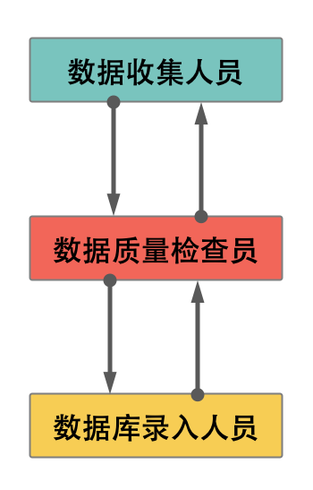

# 数据收集及处理

在系统构建的时候免不了需要灌入大量的初始数据，本文将基于个人在工作中总结出的经验，给出数据收集的流程，数据处理程序的结构及常见问题的说明。只是一些浅显的见解，还需要更多的经验。

文档结构：

<!-- TOC -->

- [数据收集及处理](#数据收集及处理)
    - [数据收集流程](#数据收集流程)
        - [直接获取数据](#直接获取数据)
        - [主动收集数据](#主动收集数据)
        - [强调说明](#强调说明)
    - [数据处理](#数据处理)
        - [数据处理流程](#数据处理流程)
        - [数据处理项目结构](#数据处理项目结构)
        - [常用程序](#常用程序)
    - [团队结构](#团队结构)
        - [数据收集人员](#数据收集人员)
        - [数据质量检查员](#数据质量检查员)
        - [数据录入人员](#数据录入人员)
    - [思考](#思考)

<!-- /TOC -->

## 数据收集流程

根据特定情景的不同，数据收集可以分为两类：

1. 直接获取数据：需求方已经有数据的积累，多是使用Excel表格存储管理，有些甚至是使用Word画的表格进行存储管理。
2. 主动收集数据：需求方没有数据积累或者只有少量的积累，需要根据需求方的要求和资源去收集数据。

### 直接获取数据

此类情况的数据一般存在以下问题：

1. 字段名称不一致，如：“email”，“邮箱”，“电子邮箱”；
2. 信息描述方式不一致，如“地址，“住宅地址”，“工作单位地址”，“工作单位”；
3. 同字段信息填写不一致，比如生日有的填写到月有的到日，有的是中文数字有的是阿拉伯数字；比如工作单位，有的是中文，有的是英文，有的是缩写；
4. 多个信息填写的问题，比如一个人有多个邮箱，有的是在同一个单元格中使用回车区分，有的使用email1，email2两列进行区分；
5. 信息错位的问题。

这些问题的处理不再本文的范围之内，会在别的文章中再做详述。

此类情况的处理流程为：

TODO：流程图

<!-- ！！！了解数据情况 -->
1. 获取并获取所有数据中的字段名及其覆盖率；
2. 分析字段的情况，如果有字段名称不一致的问题则需要确认主要使用字段并构建字段映射表；如果有多种不同类型的表还需要找出其中的关联并确保字段的一致性；
3. 根据字段覆盖率确认哪些是重要字段（必须存在或者具有主键作用的），哪些是次要的（可以不存在数据的），哪些是不需要的；
4. 根据确认的重要字段查看信息的完整度情况（比如，重要字段全都存在的数据量）；

<!-- ！！！确认存储策略 -->
5. 确认存储结构，尽量不丢失信息
6. 确认字段存贮策略（特别注意查重策略，合并策略）。特别是信息描述不一致的问题，如果不易处理，需要人工参与（此处需要与数据使用方进行沟通）；
7. 根据存储策略查看损失数据情况，根据接收程度动态调整“重要字段”、“存储结构”和“存储策略”；
8. 最后给出“数据库字段说明文档”和“字段处理策略文档”；

### 主动收集数据

此类情况问题一般存在以下问题：

1. 收集表的字段设计问题：
   - 字段描述模糊，如：报名时间，该字段的含义包含两部分“报名开始时间”和“报名结束时间”，稳妥起见应该拆分成两个字段
   - 没有添加数据验证，比如：性别，民族等因该提供下拉表格，以防填写数据格式不一致；出现不可能的时间比如20190230，出现截止时间小于开始时间；时间填写格式不一致，有的填写到日，有的填写到月，有的使用`-`分隔年月日，有的使用`/`，有的直接写2019年9月1日

2. 不同类型的表格，关联信息不一致，比如一个表的公司名称使用全称，另一个表的名称使用简称

这些问题的处理不再本文的范围之内，会在别的文章中再做详述。

此类问题，如果时间和条件允许，应该构建一个信息管理系统，一个登录页，一个注册页和一个信息更新的页面就可以很好的解决该类问题了。但是时间和条件不允许的化，那么就需要使用Excel表采集的方式了：

此类问题的处理流程为：

TODO：流程图

<!-- 收集前 -->
1. 确认收集数据的字段及其类型，根据需求的不同坑会需要字段的中文翻译；
2. 确认字段的重要程度，是否为必填字段，或是选填字段（虽然可以在收集完成之后根据字段覆盖率确定，但是避免产生无效收集的数据，最好提前确定）
3. 表格设计，每一列的信息都是独立的，清晰的，易处理的；根据字段的需要进行数据验证的设置（内容的形式，如时间格式；填写内容的范围，如性别，民族）。根据需求方的使用场景不同，还可能会有表头的需求；

<!-- 收集后 -->
4. 收集完成后，获取字段覆盖率，信息完整度（有效填写信息数量）；
5. 确认字段存贮策略（特别注意查重策略，合并策略）；
6. 如果收集前准备充分，收集中严格执行，那么可以直接入库；
7. 如果依然存在问题，需要根据情况不断调整字段存贮策略。如果存在不易处理的数据，则需要人工协助。
8. 最后给出“数据库字段说明文档（包字段数据验证要求）”和“字段处理策略文档”；

### 强调说明

确认字段重要程度步骤十分重要，必填字段会影响查重合并的质量，也会影响有效入库数据的数量；确认的过程不仅需要和需求方协商、确认，还需要和使用方协商、确认（特别是前端、处理流程下游人员）

## 数据处理

### 数据处理流程

1. 抽取字段信息
2. 计算字段覆盖率
3. 确定字段的重要程度
4. 计算信息覆完整度
5. 确定查重策略
6. 确定合并策略（注意合并时的查重策略和5所涉及的查重策略可能是不同的）TODO：give example
7. 确定字段的存储结构
8. 编写文件数据验证程序，将不对的数据返回给数据收集人员进行修改
9. 编写导入程序
10. 数据备份（可选）
11. 运行导入程序

导入前，可以使用程序验证文件的正确性，如果在处理某一行出现错误，应该将该行标出（比如使用不同底色），然后在该列最后增加失败原因，给出出错的字段，以便确认问题并进行修改。

### 数据处理项目结构

```bash
- data
  - backup # 数据备份文件
  - log    # 日志
- doc      # 文档，存放数据字典，数据发布文档，处理策略文档等
- input    # 存放输入文件
- output   # 存放生成的文件
- model    # 数据的存储结构
- service  # 数据库存取，查询等程序
- utils    # 数据库链接，API访问，日志等工具程序
- scripts  # 主要的处理流程的程序
- tools    # 在scripts中常用的程序，经过封装后可以移到这里，比如：字段抽取，字段覆盖率的代码
```

由于导入的需求视文件的结构而定，所以一般根据具体的需求编写具体的程序，但是积累一段时间后就会发现共同的需求，就可以封装成一个公用的方法，放到tools 中。

### 常用程序

1. 抽取文件的字段
2. 字段覆盖率
3. 信息完整度

## 团队结构

团队成员应该分为三部分：

- 数据收集人员
- 数据质量检察员
- 数据录入人员



### 数据收集人员

根据需要设立数据收集人员，数据收集人员主要的任务：

1. 根据要求设计收集表
2. 汇总收集表
3. 简单验证表的结构是否正确（避免出现错行的问题）

所需素质：

1. 可以使用Excel的数据验证功能

### 数据质量检查员

为了减少数据录入人员的压力，设立数据质量检查员，其主要任务：

1. 对数据收集人员提交的数据进行审核，判断数据是否可录入
2. 对需要人工手动调整数据文件的情况，组织并开展相关活动
3. 对接录入API的问题，撰写API文档，测试API，协调多方合作
4. 对接数据使用方（可能是用户、前端等）的需求
5. 录入数据后的审核

数据质量检查员，有些像产品经历，具有该角色的人需要从分了解数据导入策略及文件中各字段的含义、联系。

所需素质：

1. 有编码经验，了解基本的数据类型
2. 有API开发经验
3. 有数据库操作经验

### 数据录入人员

数据录入人员的主要任务：

1. 根据确定的导入流程、策略，实现程序
2. 备份数据
3. 简单验证合并结果

## 思考

1. 该问涉及到的处理过程都是针对小数据量（几万）的，如果针对数据量比较大的导入情况该如何去做？
